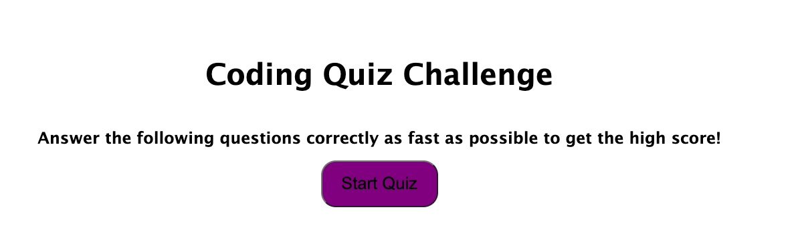

# timed-quiz-game

## The Module 4 Challenge is to create a quiz game with dynamic interactions that sllow the user to play the game, get a score, save their score, and play again!

## Table of Contents

- [Installation](#installation)
- [Usage](#usage)
- [Credits](#credits)
- [License](#license)

## Installation

Clone the repository to your machine in a new Github repo. Copy all the files and get crackin!

## Usage

This page is a fun game to test your coding skills

deployed site: https://clarissafuller.github.io/timed-quiz-game/

  
## Credits

Many thanks to my bootcamp teachers for helping me out with this!

## License

MIT
